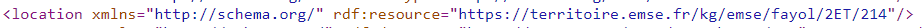

# Semantic web projects 

Convert events extracted from ICS file(unstructured) to RDF and web sites(json-ld) and publish it to platform territoire.

## Technologies Used 
- [ ] Java as a programming lanaguage 
- [ ] Spring boot for creating REST API
- [ ] Apache Jena for RDF modeling 
- [ ] Carbon LDP(Platform territoire)
- [ ] SPARQL -  For date extraction 
- [ ] SHACL -  For Event validation
- [ ] IntelliJ as IDE
- [ ] Curl and Postman for API checking

## Procedure to run the application

- [ ] Open the project using any of the java IDE
- [ ] Run the application 
- [ ] Go to the location http://localhost:8080/swagger-ui/index.html#/ to interact with the application 
- [ ] I used Swagger UI as front-end for interatcting with the platform


## Features Implemented

### Convert any ICS file to rdf and publish it in Territorie Platform.

Enter the location of the ics file and string identifier to identify this dataset. I used ical4j library to parse the ics file and convert it to RDF

Please check this link to see the generated rdf graphs from the ics file -  https://territoire.emse.fr/ldp/arunfinal/.

- [ ] Run the application and go to this URL http://localhost:8080/swagger-ui/index.html#/publish-controller/uploadFileUsingPOST


- [ ] Information of classroom are already published in platform territoire and it is available in the format "https://territoire.emse.fr/kg/emse/fayol/floorname/roomNo"  where floorname can be 1ET,2ET etc and roomNo can be 104,212 etc.  I linked this url with the help of https://schema.org/location while using an  ics file downloaded from the cps2 time table. 


- [ ] While creating RDF graphs the event check in platform territiore for the similar events. If it is available, then link the both the events using owl:sameAs in both the directions.

###### SPARQL Ask query to check if any similar events are alreeady publish in platform territoire
```python 
PREFIX xsd: <http://www.w3.org/2001/XMLSchema#>
PREFIX schema: <http://schema.org/>
ASK {  
 ?uri  schema:editor ?editor;
        schema:endDate ?endDate;
        schema:startDate ?startDate;
        schema:location ?loc ;
        schema:startTime ?startTime ;
        schema:endTime ?endTime ;
FILTER  (?editor = "Arun"@en && regex(str(?loc), "https://territoire.emse.fr/kg/emse/fayol/2ET/212") &&  ?endDate = "2023-01-06"^^xsd:date &&  ?startDate = "2023-01-06"^^xsd:date && ?startTime = "11:00:00"^^xsd:time && ?endTime = "11:00:00"^^xsd:time )
 }
```     

###### If the ASK query return true then it get the URI of the similar events using SELECT query 
```python 
PREFIX xsd: <http://www.w3.org/2001/XMLSchema#>
PREFIX schema: <http://schema.org/>
SELECT ?url {  
 ?url  schema:editor ?editor;
        schema:endDate ?endDate;
        schema:startDate ?startDate;
        schema:location ?loc ;
        schema:startTime ?startTime ;
        schema:endTime ?endTime ;
FILTER  (?editor = "Arun"@en && regex(str(?loc), "https://territoire.emse.fr/kg/emse/fayol/2ET/212") &&  ?endDate = "2023-01-06"^^xsd:date &&  ?startDate = "2023-01-06"^^xsd:date && ?startTime = "11:00:00"^^xsd:time && ?endTime = "11:00:00"^^xsd:time )
 }
 ```  
- [ ] Then it send a get request to the selected URL for the ETAG and the triples contained in that URL 
- [ ] Add the URL of the new event using owl:sameAs
- [ ] Republish the triples to the platform territoire using put request.


- [ ] Screenshot for showing owl:sameAs -  Event URL -  https://territoire.emse.fr/ldp/arunfinal/sem-course-event-1/


- [ ] Screenshot for showing owl:sameAs -  Event URL -  https://territoire.emse.fr/ldp/arunraveendransheelafinal/course-event-1/


### Extract json-ld from website and publish the data in Platform Territoire.

- [ ] Run the application and go to this url http://localhost:8080/swagger-ui/index.html#/publish-controller/attachWebURLUsingPOST


- [ ] Here I used JSOUP library(https://jsoup.org/) which is web scrapping java library for extracting data from the webites. I used <script/> tag with content-type "application/json-ld"  for the extraction. 

- [ ] While creating RDF graphs the event check in platform territiore for the similar events. If it is available, then link the both the events using owl:sameAs in both the directions.

###### SPARQL Ask query to check if any similar events are alreeady publish in platform territoire
```python 
PREFIX xsd: <http://www.w3.org/2001/XMLSchema#>
PREFIX schema: <http://schema.org/>
ASK {  
 ?uri  schema:editor ?editor;
        schema:startDate ?startDate;
        schema:name ?eventName ;
        schema:endDate ?endDate ;
        schema:location ?loc.
?loc schema:name ?placeName ;  
FILTER  (?editor = "Arun"@en &&  ?endDate = "2023-12-28"^^schema:Date &&  ?startDate = "2023-01-12"^^schema:Date && ?eventName = "Marché de Chavanelle" && ?placeName = "Place Chavanelle")
}
``` 

###### If the ASK query return true then it get the URI of the similar events using SELECT query 
```python 
PREFIX xsd: <http://www.w3.org/2001/XMLSchema#>
PREFIX schema: <http://schema.org/>
SELECT ?url {  
 ?url  schema:editor ?editor;
        schema:startDate ?startDate;
        schema:name ?eventName ;
        schema:endDate ?endDate ;
        schema:location ?loc.
?loc schema:name ?placeName ;  
FILTER  (?editor = "Arun"@en &&  ?endDate = "2023-12-28"^^schema:Date &&  ?startDate = "2023-01-12"^^schema:Date && ?eventName = "Marché de Chavanelle" && ?placeName = "Place Chavanelle")
}
 ```  
- [ ] Then it send a get request to the selected URL for the ETAG and the triples contained in that URL 
- [ ] Add the URL of the new event using owl:sameAs
- [ ] Republish the triples to the platform territoire using put request.


### Add attendees for the selected course

- [ ] User need to enter the course name, start data and attendee name.  Based on this information the with the help of a SPARQL query I find the URL of the corresponding events.  Go to this url to enter these information -  http://localhost:8080/swagger-ui/index.html#/attendee-controller/
addAttendeeUsingPOST 


- [ ] Then send a get request to get the ETAG and triples 
- [ ] Add the attendee and republish the event using put request 


###### SPARQL query to get the URI from course name and startDate
```python 
PREFIX xsd: <http://www.w3.org/2001/XMLSchema#>
PREFIX schema: <http://schema.org/>
SELECT ?url ?serialNumber
 WHERE {  
      ?url schema:accessibilitySummary ?summary ;
       schema:startDate ?startDate ;
       schema:editor ?eitor ;
        FILTER (regex(?summary, "%s" , "i" ) && (?startDate = "%s"^^xsd:date) && (?eitor = "Arun"@en)) .
 }
 ``` 

 ### Filter events in saint-etienne that are courses

 - [ ] I added a class https://schema.org/CourseInstance to seperate the courses and other event. 

 - [ ] Filter these events using the below REST API(Get Request) -  go to this link http://localhost:8080/swagger-ui/index.html#/event-controller/getEventsThatAreCoursesUsingGET  and execute 

 

```python 
PREFIX xsd: <http://www.w3.org/2001/XMLSchema#>
PREFIX schema: <http://schema.org/>
PREFIX rdf: <http://www.w3.org/1999/02/22-rdf-syntax-ns#>
PREFIX owl: <http://www.w3.org/2002/07/owl#>              
select  ?uri ?sameAs
WHERE   
 {
?uri a schema:CourseInstance;
           schema:editor ?editor ;
          schema:serialNumber ?serialNumber ; 
          owl:sameAs ?sameAs ; 
FILTER (?editor = "Arun"@en && regex(?serialNumber,"sem-", "i")) .
 }
 ``` 
- [ ] Again the sparql result is converted to rdf graph and it is available as response
- [ ] Below shows a example rdf graph when you execute this REST API

 ```python
@prefix owl:    <http://www.w3.org/2002/07/owl#> .
@prefix schema: <http://schema.org/> .
@prefix xsd:    <http://www.w3.org/2001/XMLSchema#> .

<http://localhost:8080/Event/saintetienne/courses>
        a                schema:EventSeries ;
        schema:category  "Events that are  Courses in Saint-Etienne" ;
        rdfs:comment     "Events in saint-etienne that are courses " ;
        [ schema:event  [ a           schema:Event ;
                  schema:url  "https://territoire.emse.fr/ldp/arunfinal/examsem-14/"^^xsd:anyURI ;
                  owl:sameAs  "https://territoire.emse.fr/ldp/arunfinal/sem-course-event-14/"^^xsd:anyURI , "https://territoire.emse.fr/ldp/arunraveendransheelafinal/course-event-14/"^^xsd:anyURI
                ] ;
         schema:event  [ a           schema:Event ;
                  schema:url  "https://territoire.emse.fr/ldp/arunfinal/sem-course-event-64/"^^xsd:anyURI ;
                  owl:sameAs  "https://territoire.emse.fr/ldp/arunraveendransheelafinal/course-event-64/"^^xsd:anyURI
                ] ;

    ] .

 ``` 

  ### Filter events in saint-etienne that are not courses
 ```python
PREFIX xsd: <http://www.w3.org/2001/XMLSchema#>
PREFIX schema: <http://schema.org/>
PREFIX owl: <http://www.w3.org/2002/07/owl#>
PREFIX rdf: <http://www.w3.org/1999/02/22-rdf-syntax-ns#>
               
select ?uri ?sameAs
WHERE   
 {
?uri schema:location ?obj ;
    schema:serialNumber ?serialNumber ; 
    owl:sameAs ?sameAs;
      schema:editor ?editor .
?obj schema:address ?address . 
?address  schema:addressLocality ?cityName .
FILTER (?editor = "Arun"@en && ?cityName = "Saint-Étienne" && regex(?serialNumber,"sem-", "i")) .
FILTER NOT EXISTS { ?uri rdf:type schema:CourseInstance .}
}
 ```

  ### List of upcoming events 
 ```python
PREFIX xsd: <http://www.w3.org/2001/XMLSchema#>
PREFIX schema: <http://schema.org/>
PREFIX rdf: <http://www.w3.org/1999/02/22-rdf-syntax-ns#>
PREFIX owl: <http://www.w3.org/2002/07/owl#>              
select  ?uri  ?sameAs
WHERE   
 {
?uri a schema:CourseInstance;
schema:editor ?editor ;
schema:startDate ?startDate;
schema:serialNumber ?serialNumber ; 
owl:sameAs ?sameAs ; 
FILTER (?editor = "Arun"@en && ?startDate > "2023-01-01"^^xsd:date && regex(?serialNumber,"sem-", "i")) .
 }
 ```


  ### List of events in a particular room 

   
 ```python
PREFIX xsd: <http://www.w3.org/2001/XMLSchema#>
PREFIX schema: <http://schema.org/>
PREFIX owl: <http://www.w3.org/2002/07/owl#>
SELECT ?uri ?sameAs {  
 ?uri  schema:editor ?editor;
        schema:location ?loc ;
        owl:sameAs ?sameAs ;
               schema:serialNumber ?serialNumber ; 
FILTER  (?editor = "Arun"@en && regex(str(?loc), "104") && regex(?serialNumber, "sem-", "i" ))
 }
 ```

  ### List of attendees for an course

  get the list of attendeed  -  http://localhost:8080/swagger-ui/index.html#/get-event-controller/getAttendeesOfAEventsUsingGET
 

 ```python
 PREFIX schema: <http://schema.org/>
PREFIX rdf: <http://www.w3.org/1999/02/22-rdf-syntax-ns#>               
select ?uri ?attendee
WHERE   
 {
?uri
    schema:serialNumber ?serialNumber ; 
      schema:editor ?editor ;
      schema:startDate ?startDate ; 
      schema:accessibilitySummary ?summary ; 
      schema:attendees ?attendees. 
?attendees schema:attendee ?attendee ;
FILTER (?editor = "Arun"@en && regex(?serialNumber,"sem-", "i") && regex(?summary,"semantic", "i") && ?startDate="2022-12-16"^^xsd:date) .
}
```

- [ ] Response 

```python
@prefix owl:    <http://www.w3.org/2002/07/owl#> .
@prefix rdfs:   <http://www.w3.org/2000/01/rdf-schema> .
@prefix schema: <http://schema.org/> .
@prefix xsd:    <http://www.w3.org/2001/XMLSchema#> .

<http://localhost:8080/course/attendees/>
        schema:attendee  [ a                schema:Person ;
                           schema:attendee  "VishnuArun" , "ArunVishnu" , "vishnu" , "Arun"
                         ] ;
        schema:event     <https://territoire.emse.fr/ldp/arunfinal/sem-course-event-1/> .

 ```
  ### SHACL validation for an Event 

  - [ ] SHACL validation is based serial number for each event 

   


```python
@prefix dash: <http://datashapes.org/dash#> .
@prefix rdf: <http://www.w3.org/1999/02/22-rdf-syntax-ns#> .
@prefix rdfs: <http://www.w3.org/2000/01/rdf-schema#> .
@prefix schema: <http://schema.org/> .
@prefix sh: <http://www.w3.org/ns/shacl#> .
@prefix xsd: <http://www.w3.org/2001/XMLSchema#> .

schema:Event
    a sh:NodeShape ;
    sh:targetClass schema:Event ;
    sh:property [
        sh:path schema:startDate ;
        sh:or (
      [
        sh:datatype xsd:date ;
      ]
      [
        sh:datatype xsd:dateTime ;
      ]
    ) ;
        sh:minCount 1 ;
        sh:maxCount 1 ;
        sh:name "start date" ;
        sh:severity sh:Violation ;
    ] ;

  sh:property [
        sh:path schema:endDate ;
        sh:or (
      [
        sh:datatype xsd:date ;
      ]
      [
        sh:datatype xsd:dateTime ;
      ]
    ) ;
        sh:minCount 1 ;
        sh:maxCount 1 ;
        sh:name "end date" ;
        sh:severity sh:Violation ;
    ] ;
  sh:property [
        sh:path schema:startTime ;
        sh:or (
      [
        sh:datatype xsd:time ;
      ]
      [
        sh:datatype xsd:dateTime ;
      ]
    ) ;
        sh:minCount 1 ;
        sh:maxCount 1 ;
        sh:name "start time" ;
         sh:severity sh:Violation ;
    ] ;

  sh:property [
        sh:path schema:endTime ;
        sh:or (
      [
        sh:datatype xsd:time ;
      ]
      [
        sh:datatype xsd:dateTime ;
      ]
    ) ;
        sh:minCount 1 ;
        sh:maxCount 1 ;
        sh:name "end time" ;
        sh:severity sh:Violation ;
    ] ;
  sh:property [
        sh:path schema:location ;
        sh:minCount 1 ;
        sh:maxCount 1 ;
        sh:name "location" ;
        sh:severity sh:Violation ;
        sh:pattern "^https://territoire.emse.fr/kg/emse/fayol/";
        sh:flags "i" ;
        sh:nodeKind sh:IRI ;
    ] ;
 sh:property [
        sh:path schema:instructor ;
        sh:minCount 1 ;
        sh:maxCount 1 ;
        sh:name "instructor" ;
        sh:severity sh:Warning ;
        sh:languageIn "@en" ; 
    ];
 sh:property [
        sh:path schema:organizer ;
        sh:minCount 1 ;
        sh:maxCount 1 ;
        sh:name "organizer" ;
        sh:severity sh:Warning ;
    ].

 ```
  ### SHACL validation to check that an event is organized by UJM or EMSE

  

 ```python
  @prefix schema: <http://schema.org/> .
@prefix sh: <http://www.w3.org/ns/shacl#> .
@prefix xsd: <http://www.w3.org/2001/XMLSchema#> .

schema:EventShape
	a sh:NodeShape ;
	sh:targetClass schema:Event ;
	sh:property [
		sh:path schema:organizer ;
		sh:minCount 1 ;
		sh:maxCount 1 ;
                sh:or (
                       [
                        sh:hasValue "UJM" ;
                       ]
                       [
                        sh:hasValue "EMSE" ;
                       ]
                       ) ;
	               ] . 
```


